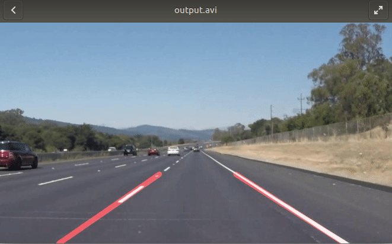

# Basic_Lane_Line_Detection

The project uses basic computer vision techniques to detect the lane lines on the road. The jupyter notebook contains the steps and well commented code for a proper understanding of the methods used.

### Output:

